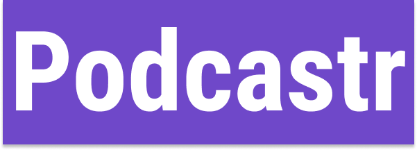
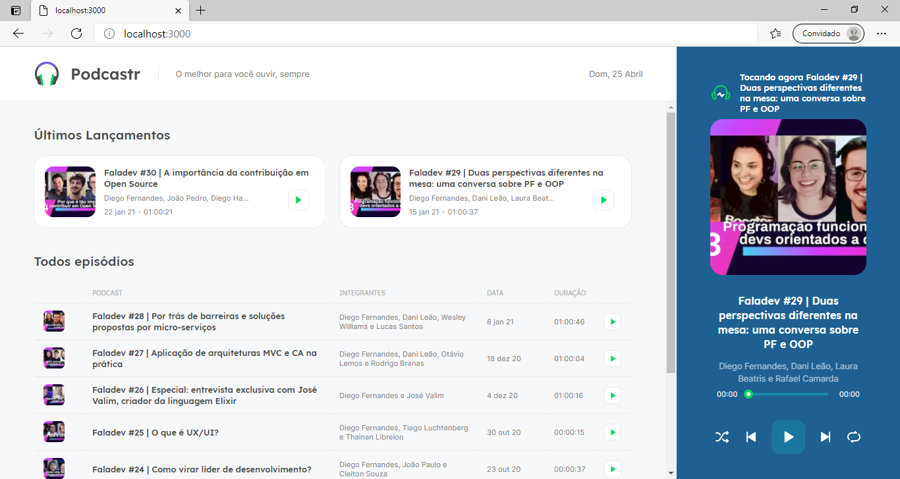

<p align="center">
  
</p>

<h1 name="sobre">ℹ Sobre o Projeto</h1>
Projeto Podcastr foi construido durante a semana Next Level Week da Rocketseat, uma plataforma de podcasts construído em ReactJS. 
As principais funcionalidades são: a listagens de podcasts com textos descritivos e o controle do audio do podcast.🎯

<h1 name="preview">:eyes: Preview do Projeto</h1>
<h3>Web</h3>


<h1 name="run">:boom: Como Executar o projeto</h1> <br>

- ### **Pré-requisitos**

  - É **necessário** possuir o **[Node.js](https://nodejs.org/en/)** instalado no computador
  - É **necessário** possuir o **[Git](https://git-scm.com/)** instalado e configurado no computador
  - Também, é **preciso** ter um gerenciador de pacotes seja o **[NPM](https://www.npmjs.com/)** ou **[Yarn](https://yarnpkg.com/)**.

```bash
# Clone Repository
$ git clone https://github.com/IanaCris/podcastr.git
```


<h3 name='api'>📦 Ligar a API Fake</h3><br>

```bash
# Com o terminal dentro da pasta do projeto
# Ligue a API
$ yarn server # ou npm run server


```
Acesse API em http://localhost:3333/episodes

<h3 name='website'>💻 Visualizar a Aplicação</h3><br>

```bash
# Vá até a pasta
$ cd podcastr

# Instale as dependências
$ yarn # ou npm install

# Inicie a aplicação em modo desenvolvedor
$ yarn dev # ou npm run dev
```
Vá para http://localhost:3000/ para ver a aplicação.


<h1 name="tecnologias">🛠 Tecnologias</h1>

As seguintes ferramentas foram usadas na construção do projeto:

- [ReactJS](https://pt-br.reactjs.org/)
- [NextJS](https://github.com/vercel/next.js/)
- [TypeScript](https://www.typescriptlang.org/)
- [axios](https://github.com/axios/axios)
